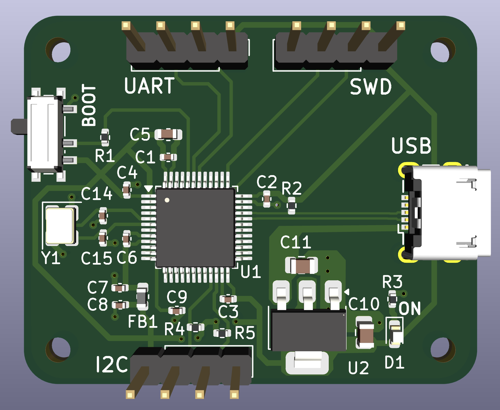
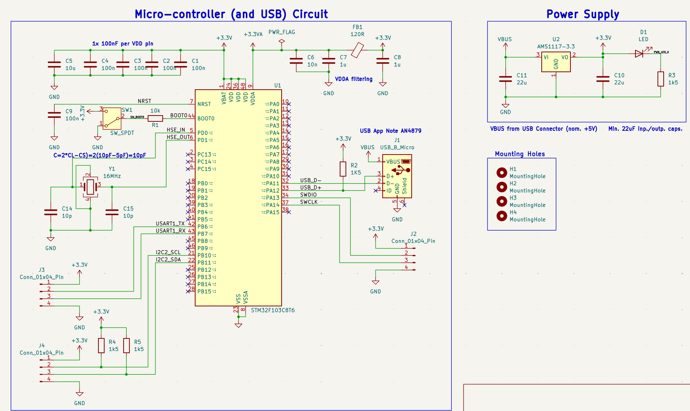
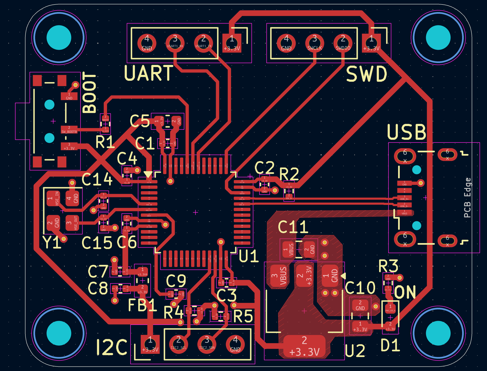
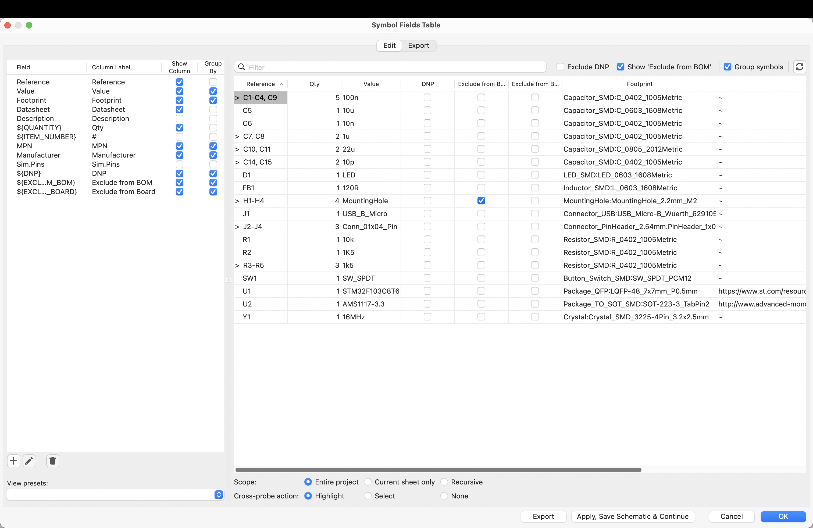
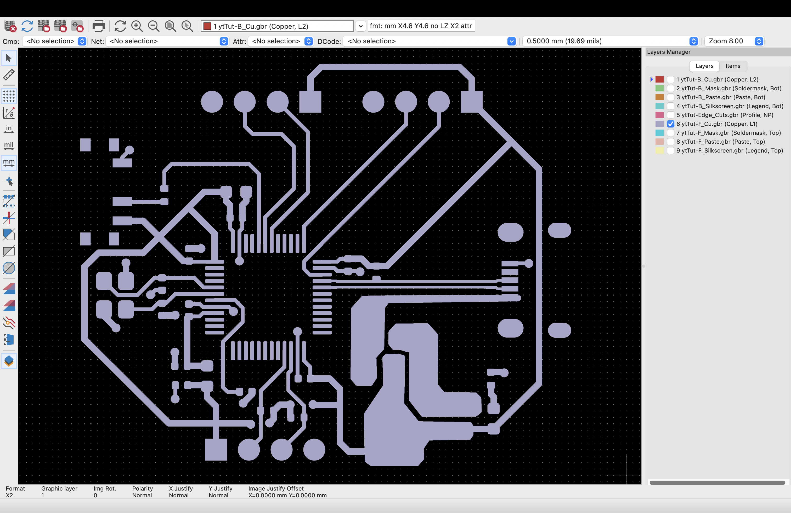

# STM32F103 Custom Development Board PCB

A custom two-layer development board built around the **STM32F103C8T6** microcontroller using **KiCad**.

This project was completed as a hands-on PCB design exercise based on **Phil's Lab's STM32 PCB tutorial**, with the goal of learning and practicing the complete workflow from **schematic capture to PCB layout and manufacturing-file generation**.

---

## Final PCB

<p align="center">
  
</p>

The completed board integrates power regulation, clock circuitry, USB, programming/debugging interfaces, serial communication interfaces, analog power filtering, and a two-layer PCB layout with a dedicated ground plane.

---

## Main Features

- **STM32F103C8T6** ARM Cortex-M3 microcontroller
- **USB Micro-B** power and data interface
- **AMS1117-3.3** linear voltage regulator
- 5 V USB VBUS to regulated **3.3 V**
- MCU decoupling and bulk capacitance
- Filtered **VDDA analog supply**
- **16 MHz external crystal oscillator**
- **BOOT0** mode-selection switch
- **NRST** reset filtering
- **SWD** programming/debugging header
- **USART/UART** communication header
- **I²C** communication header with pull-up resistors
- USB **D+ / D− differential-pair routing**
- Power-status LED
- Four M2 mounting holes
- Two-layer PCB with **B.Cu GND plane**
- ERC and DRC verification
- BOM, Gerber, drill, and position-file generation

---

## System Architecture

```text
                     USB Micro-B
                         │
          ┌──────────────┴──────────────┐
          │                             │
       USB D+/D−                     VBUS 5 V
          │                             │
          ▼                             ▼
       STM32F103                  AMS1117-3.3
          │                             │
          │                             ▼
          │                           3.3 V
          │                             │
     ┌────┼───────────────┬─────────────┼─────────────┐
     │    │               │             │             │
     ▼    ▼               ▼             ▼             ▼
    SWD  USART           I²C        STM32 VDD      VDDA Filter
                                                    │
                                             Ferrite Bead +
                                               Capacitors
                                                    │
                                                    ▼
                                                STM32 VDDA
```

---

## Schematic Design

<p align="center">
  
</p>

The schematic was organized into several functional blocks:

- STM32F103C8T6 microcontroller
- 3.3 V power regulation
- VDD decoupling
- VDDA filtering
- NRST reset circuit
- BOOT0 selection
- 16 MHz crystal oscillator
- USB interface
- SWD interface
- USART/UART interface
- I²C interface
- power indicator LED
- mounting holes

The design uses an **AMS1117-3.3 linear regulator** to convert USB VBUS to the 3.3 V rail required by the STM32 and external interfaces.

A ferrite-bead filtering network provides a cleaner 3.3 V analog supply for the STM32 VDDA pin.

---

## Communication Interfaces

### SWD

The SWD header provides programming and debugging access through:

- SWDIO
- SWCLK
- 3.3 V reference
- GND

It is intended for use with an **ST-Link programmer/debugger**.

### USART / UART

A 1×4 header exposes:

- TX
- RX
- 3.3 V
- GND

This provides a simple serial communication interface for external devices.

### I²C

A separate 1×4 header exposes:

- SCL
- SDA
- 3.3 V
- GND

Pull-up resistors are included on SCL and SDA as required by the I²C bus.

### USB

The STM32's native USB interface is connected through:

- PA11 → USB D−
- PA12 → USB D+

The pair was routed together as a differential pair on the PCB.

---

## PCB Layout

<p align="center">
  
</p>

The PCB was implemented as a **two-layer board**.

### F.Cu

Used primarily for:

- signal routing
- power routing
- component interconnections

### B.Cu

Used primarily as a continuous **GND plane**.

Ground vias connect front-side ground connections to the bottom ground plane.

---

## Placement and Routing

Important layout decisions included:

- decoupling capacitors placed close to STM32 power pins
- crystal placed close to the oscillator pins
- USB connector positioned at the board edge
- regulator positioned near the USB power input
- communication headers positioned for easy access
- mounting holes placed near the board corners
- B.Cu kept largely continuous as a ground plane

Two primary trace widths were used:

- **0.3 mm** for most signals and fine-pitch MCU connections
- **0.5 mm** for wider 3.3 V power distribution

USB D+ and D− were routed as a differential pair.

---

## Grounding Strategy

The bottom copper layer was filled with a **GND copper zone**.

This provides:

- a low-impedance ground path
- simpler ground routing
- improved signal return paths
- improved noise performance

GND vias were used where SMD ground connections needed to connect to the B.Cu ground plane.

---

## Design Verification

### ERC

KiCad's **Electrical Rules Checker** was used during schematic development to identify electrical-rule issues and unintentionally unconnected pins.

### DRC

KiCad's **Design Rules Checker** was used after layout and routing to verify:

- connectivity
- clearances
- trace widths
- via dimensions
- board-edge spacing
- unconnected items

Final result:

- **0 DRC errors**
- **0 unconnected items**

One understood warning remained because the BOOT0 switch footprint had been locally modified compared with the original KiCad library footprint.

---

## Bill of Materials

<p align="center">
  
</p>

A BOM was generated from KiCad containing:

- reference designators
- quantities
- component values
- footprints
- datasheets

Additional fields were added for:

- Manufacturer
- Manufacturer Part Number (MPN)

These fields can be populated with the exact components selected for fabrication and assembly.

---

## Manufacturing Outputs

<p align="center">
  
</p>

The project was taken through the manufacturing-output stage.

Generated files include:

- front and back copper Gerbers
- solder-mask layers
- silkscreen layers
- Edge.Cuts
- drill files
- BOM
- component position / pick-and-place files

The Gerbers were reviewed using KiCad's Gerber Viewer before finalizing the output files.

---

## Design Workflow

```text
Study STM32 Requirements
          │
          ▼
    Create Schematic
          │
          ▼
         ERC
          │
          ▼
   Assign Footprints
          │
          ▼
   Place Components
          │
          ▼
 Route Signals + Power
          │
          ▼
 Add GND Vias + Plane
          │
          ▼
     Add Silkscreen
          │
          ▼
         DRC
          │
          ▼
     3D Inspection
          │
          ▼
       Generate BOM
          │
          ▼
Gerbers + Drill + Position Files
```

---

## Repository Structure

```text
STM32F103-Custom-Development-Board-PCB/
│
├── README.md
│
├── hardware/
│   └── KiCad schematic, PCB, project, and related design files
│
├── manufacturing/
│   └── Gerbers, drill files, BOM, and position files
│
├── media/
│   ├── Schematic.png
│   ├── Layout.png
│   ├── 3D-Preview.png
│   ├── BOM.png
│   └── Gerber.png
│
└── documentation/
    └── Detailed technical documentation and design notes
```

---

## Key Skills Practiced

- PCB Design
- KiCad
- STM32 hardware design
- Schematic capture
- PCB layout and routing
- Power distribution
- Ground-plane design
- Differential-pair routing
- Component footprint selection
- ERC / DRC
- BOM generation
- Manufacturing-file preparation
- Datasheet interpretation
- STM32CubeIDE / CubeMX

---

## Project Outcome

The project resulted in a complete two-layer STM32 development-board design containing:

- STM32F103C8T6
- regulated 3.3 V power
- filtered analog supply
- external 16 MHz oscillator
- USB connectivity
- SWD programming/debugging
- USART
- I²C
- BOOT0 selection
- reset circuitry
- power indication
- mounting holes
- front-layer routing
- bottom-layer ground plane
- manufacturing outputs

The design was completed through the **PCB verification and manufacturing-preparation stage**.

---

## Detailed Documentation

A much more detailed explanation of the project is available in the [`documentation`](documentation/) folder.

The technical document covers topics such as:

- decoupling and bulk capacitors
- ferrite-bead filtering
- VDD / VDDA
- NRST
- BOOT0
- crystal oscillator operation
- USB D+ pull-up
- USB differential signalling
- SWD
- UART
- I²C and open-drain signalling
- vias and ground planes
- footprints and 3D models
- ERC and DRC
- BOM preparation
- Gerbers and manufacturing outputs

This README is intended as a concise technical overview, while the documentation folder contains the full theory and design notes.

---

## Attribution

This project was built as a **hands-on PCB design exercise based on Phil's Lab's STM32 PCB tutorial**, with the goal of understanding and practicing the complete schematic-to-manufacturing workflow.

The project is presented as a learning implementation rather than as an original reference-board architecture.

---

## Tools

- **KiCad** — schematic capture, PCB layout, ERC/DRC, 3D inspection, Gerber generation
- **STM32CubeIDE / CubeMX** — STM32 peripheral and pin configuration
- **STM32F103C8T6** — target microcontroller
- **GitHub** — project documentation and design-file management
